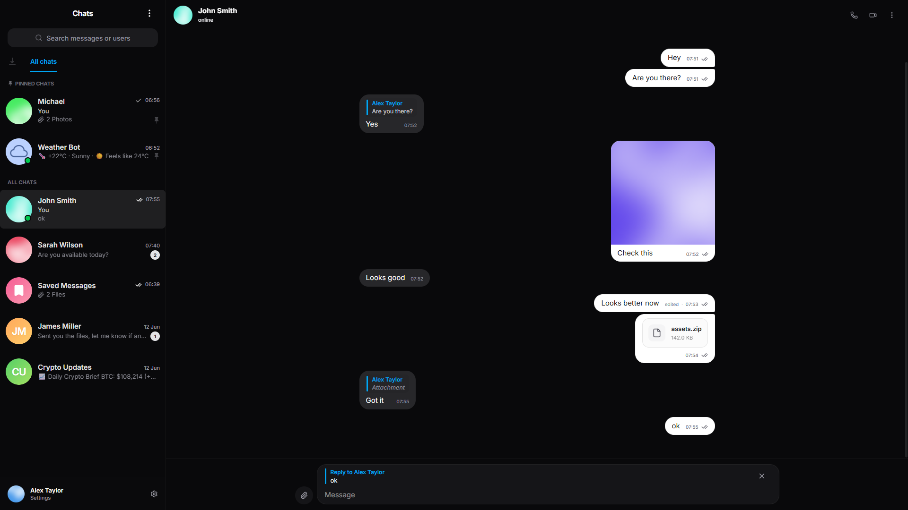

[](https://opensource.org/licenses/MIT) 

# Aerogram



## About

Aerogram is a real-time messaging platform built with Go and React. It is designed as a modular monolith focused on low-latency communication, type safety, and scalable architecture. The backend uses a gRPC-based internal system with a GraphQL API layer. The frontend is built with React, Relay, and shadcn/ui, using Tailwind CSS for styling and UI composition. The project provides a solid foundation for building modern real-time chat applications.

---

## Prerequisites

The following environments are required for local development and have been tested for compatibility:

* **Go:** `v1.24` or higher (**Required**)
* **Docker:** `v29.3.1`+ with Compose
* **Node.js & npm:** `v24.14.0`+ / `v11.12.0`+
* **PostgreSQL:** `v16.13`+ (psql client)
* **Redis:** `v7.0.15`+ (redis-cli)
* **Tools:** `golang-migrate`, `mkcert`, `sqlc`, and `gqlgen` (optional/development)

---

## Configuration

Before running the application, you must set up your environment variables:

1. Copy the example configuration file:
```bash
cp .env.example .env
````

2.  Open `.env` and update the values (API keys, database credentials, etc.) to match your local environment.

-----

## Quick Start

### Docker (Recommended)

The fastest way to launch the entire stack with automatic TLS:

1. **Clone this repository:**
    ```bash
    git clone https://github.com/tr1xdev/aerogram-messenger.git && cd aerogram-messenger
    ```
2. **Build and start services:**
    ```bash
    docker compose up --build -d
    ```
3. **Install SSL Trust:**
    To trust Caddy's local certificates in your browser and system:
    
    ```bash
    make setup-certs
    ```
4. **Access the application:**
    * **Frontend:** [https://localhost:3443](https://localhost:3443)
    * **Backend API:** [https://localhost:3443/query](https://localhost:3443/query)

### Local Development

1. **Setup Infrastructure & Deps:**
    ```bash
    make infra          # Starts Postgres & Redis containers
    make install-deps   # Installs Go/NPM modules & GeoIP data
    ```
2. **Generate TLS Certificates:**
    Required for secure communication outside Docker:
    ```bash
    mkdir -p certs && mkcert -install && mkcert -destdir certs localhost
    ```
3. **Code Generation:**
    ```bash
    make proto gql      # Generates gRPC and GraphQL code
    ```
4. **Run Services (in separate terminals):**
    ```bash
    make dev-backend    # Starts Go server at https://localhost:8080
    make dev-frontend   # Starts Vite at http://localhost:5173
    ```

## Features

### Messaging
- Private chats, group conversations, and channels
- Media and file attachments support
- Rich previews for images (zoom support), text, and file downloads
- Message actions (reply, edit, delete)

### Accounts & Auth
- OTP-based registration (optionally enabled for login via config)
- Session management in user profile

### Presence & Users
- Online/offline status and last seen activity
- User avatars
- User management in groups and channels (kick, promote, demote admins)

### Chats
- Pinning and deleting chats from chat list
- Clean and intuitive chat interface

### Platform
- Rate limiting for API and messaging endpoints
- Bot development via API-based SDK

### Bots
- Bot management interface (`/bots`)
- Extensible system for bot integrations
